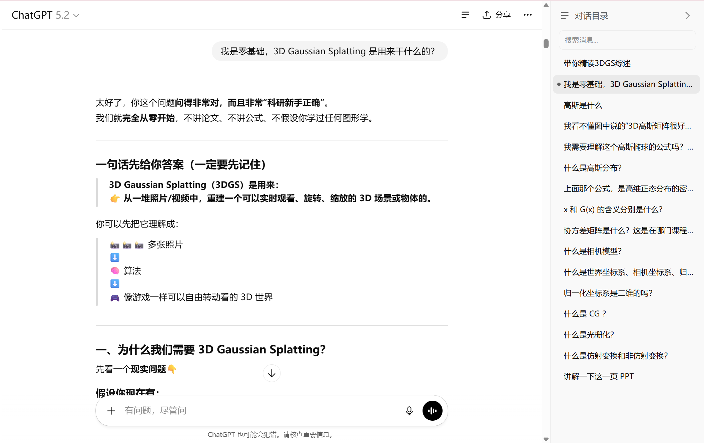
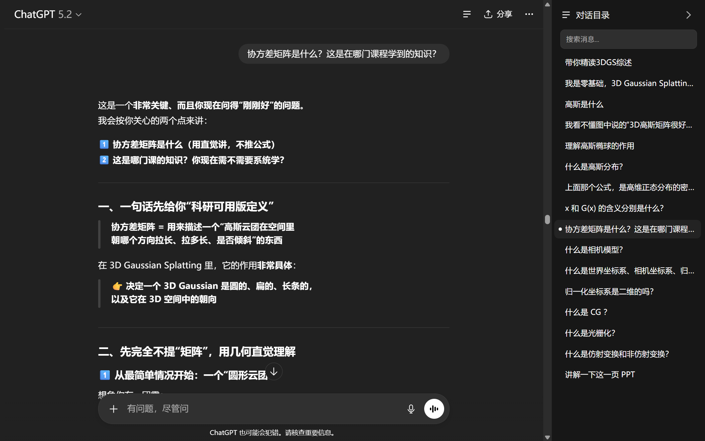
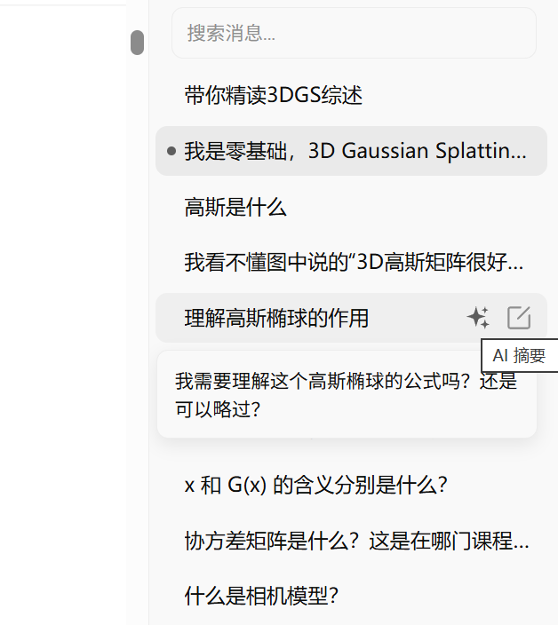
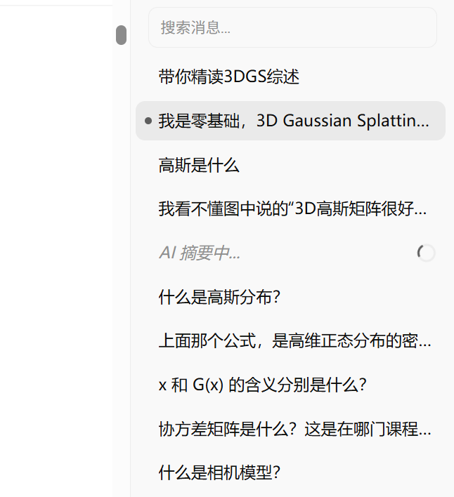

# Navigator for ChatGPT

为 ChatGPT 打造的对话导航工具，自动生成侧边目录，助您在长对话中快速定位


## 简介

**Navigator for ChatGPT** 是一款浏览器扩展（当前仓库为 Firefox PC 本地导入版本），专为 ChatGPT 深度用户设计。当您与 ChatGPT 进行长篇对话时，它会自动在页面右侧生成一个侧边栏目录面板，让您可以一目了然地查看对话结构，并快速跳转到任意问答位置。





## 功能特性

### 侧边栏布局
- 以右侧边栏形式嵌入 ChatGPT 页面，与左侧边栏对称
- 打开/关闭时主内容区宽度自动调整，不遮挡对话内容
- 折叠按钮集成在 ChatGPT 右上角，与原生按钮风格一致

### 统一视觉风格
- 直接使用 ChatGPT 原生 CSS token 变量，自动适配亮色/暗色模式
- 交互效果与 ChatGPT 左侧边栏保持一致
- 字体、颜色、间距均遵循 ChatGPT 的设计规范

### 自动生成目录
- 实时扫描对话内容，提取用户提问作为目录项
- 支持折叠/展开面板，不影响正常使用

### 快速跳转
- 点击目录项即可平滑滚动到对应位置
- 指示点标记当前跳转目标
- 自动高亮当前可视区域的对话项

### AI 摘要
- 一键 AI 自动提取摘要





### 自定义重命名
- 支持为任意目录项设置自定义标题
- 重命名数据按对话独立保存，互不干扰
- 悬停显示完整内容的 Tooltip 提示

### 智能搜索
- 支持关键词过滤目录项
- 同时搜索原始内容和自定义标题
- 实时过滤，快速定位

## 安装方法

### Firefox（PC）本地导入

1. **下载并解压**：下载本项目代码或 release 压缩包，并解压到本地目录。
2. **打开调试页**：在 Firefox 地址栏输入 `about:debugging#/runtime/this-firefox`。
3. **临时载入扩展**：点击「临时载入附加组件」。
4. **选择清单文件**：在项目目录中选择 `manifest.json`。
5. **开始使用**：访问 [ChatGPT](https://chatgpt.com) 或 [chat.openai.com](https://chat.openai.com)，点击右上角折叠按钮展开右侧目录面板。

> 说明：`about:debugging` 的临时载入在重启 Firefox 后需要重新导入，适合本地开发和自用测试场景。

## 使用指南

| 操作 | 说明 |
|------|------|
| **点击目录项** | 跳转到对应的对话位置 |
| **点击按钮** | 重命名目录项（悬停时显示） |
| **输入框回车** | 确认重命名 |
| **输入框 ESC** | 取消重命名 |
| **搜索框输入** | 实时过滤目录项 |
| **折叠按钮** | 折叠/展开侧边栏 |

## 项目结构

```
ChatGPT-Chat-Navigator/
├── manifest.json      # 扩展配置文件
├── content.js         # 核心脚本
├── styles.css         # 样式文件
├── icons/             # 图标资源
│   ├── icon16.png
│   ├── icon32.png
│   ├── icon48.png
│   └── icon128.png
├── PRIVACY.md         # 隐私政策
└── README.md          # 说明文档
```

## 隐私说明

- 本扩展完全在本地运行，不收集、不上传任何用户数据
- 仅使用 `chrome.storage.local` 保存重命名偏好设置
- 详见 [PRIVACY.md](PRIVACY.md)
